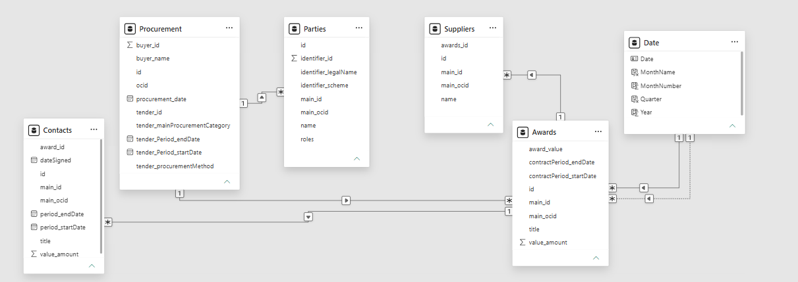

# DSA3050 - Public Procurement (PPRA Kenya) Project

Dataset: Kenya: Public Procurement Regulatory Authority (PPRA)
Source: https://data.open-contracting.org/en/publication/147#access

## Project overview
This project uses the PPRA (Kenya) procurement dataset to analyse public procurement activity, award values, suppliers, and process performance. The goal is to produce a clear, reproducible analytical workflow and a Power BI report answering a set of governance and procurement questions.

## Reason for selecting this dataset
- Relevance: Public procurement represents a major portion of government spending; analysing it yields insights into public-sector market structure and potential inefficiencies or concentration of suppliers.
- Richness: The PPRA / Open Contracting dataset contains multi-year records with parties, award values, procurement methods, contract dates and statuses — enabling time series, supplier analysis and concentration metrics.
- Accessibility and transparency: The data is open and documented, which supports reproducible analysis and aligns with public policy and auditing use-cases.

## Main data variables (typical fields to expect)
- ocid / tender_id / procurement_id — unique tender identifier
- title / description — tender title / description
- procuring_entity / buyer_name — name of the government entity issuing the tender
- procurement_category / item classifications / cpv — category or classification of goods/services
- procurement_method — e.g., Open, Restricted, Direct/Sole Source, Competitive Negotiation
- award_id — unique award identifier
- award_date — award publication or award decision date
- award_value / value.amount / value.currency — monetary value of award
- supplier / supplier_name / parties — winning supplier(s) and their details
- contract_id — linked contract identifier
- contract_start / contract_end — contract period
- status / tender_status / award_status — current completion status
- bid_count / number_of_bids — how many bids received (if available)
- lots / lot_id — lot information (if tenders are split)

Note: field names may vary in the downloaded JSON/CSV. We'll map the dataset's schema to these canonical names during ETL.

## What the data represents
Each procurement record describes a procurement process (tender) run by a procuring entity in Kenya under PPRA or related systems. Records may include multiple related objects: tender, awards, contracts and parties.

## Business / analytical questions (from your brief)
1. How have the number and value of Kenyan public procurement processes changed over time?
2. Which procuring entities and procurement categories account for the highest total award values?
3. Which suppliers receive the largest number and value of public procurement awards?
4. How concentrated are procurement awards among the largest suppliers?
5. Which procurement methods are most frequently used, and how do their award values compare?
6. Which entities have the longest procurement-processing durations?
7. What proportion of procurement records contain missing values, missing parties or missing award and contract information?

## Which questions I intend to investigate (project scope)
I plan to investigate all seven questions above, prioritised as follows:
- Core time-series and volume/value trends (Q1)
- Top procuring entities and categories by award value (Q2)
- Supplier-level analysis: counts, total values and concentration (Q3 & Q4)
- Procurement method frequency and value comparison (Q5)
- Procurement-process durations by entity and category (Q6)
- Data quality assessment and missingness profiling to support interpretation (Q7)

These questions will produce both descriptive insights and diagnostic metrics useful for procurement oversight.

## Power Query transformations (Power BI / Power Query Editor)
Below are the main Power Query transformations applied while preparing the dataset for analysis. Each entry lists the Problem observed in the raw data, the Transformation applied in Power Query, the Reason for the change, and the Result achieved. Screenshots showing the Power Query steps are included where relevant (files in screenshots/).

1) Remove unnecessary / sensitive columns
- Problem: Several columns provided no analytical value (e.g., description, address, language with only "English"), or contained sensitive contact information (email, telephone) which should not be used in analytics.
- Transformation: Used Home → Remove Columns (or right-click column → Remove) to drop Description, Address, Email, Telephone, Timestamp, Language and Status columns.
- Reason: Removing non-analytical and sensitive columns reduces dataset size, simplifies downstream joins and ensures privacy compliance.
- Result: Dataset contains only fields relevant for analysis (tender identifiers, dates, values, procuring entity, suppliers, categories).


2) Split date-time fields into Date and Time
- Problem: DateTime columns contained combined date and time values that made it harder to analyse by date period.
- Transformation: Used Transform → Split Column by Delimiter or DateTime → Date to extract Date and Time parts (created separate date fields like publication_date, award_date_date).
- Reason: Time-of-day is not required for most procurement trend analyses; splitting ensures correct type for date aggregations.
- Result: Clear Date fields for time-series grouping and duration calculations.


3) Rename date fields correctly
- Problem: The CSV used inconsistent field names; a field labelled as "start" contained later dates while "end" contained earlier dates (mismatch between label and content).
- Transformation: Inspect column values and use Transform → Rename to give correct names (e.g., rename "tender_start" and "tender_end" to match observed semantics).
- Reason: Correct field names prevent incorrect duration calculations and misinterpretation during analysis.
- Result: Date fields accurately describe the values they hold and feed correct duration and ordering logic.


4) Change identifier column type to Text
- Problem: Table ID was numeric and Power Query treated it as a number.
- Transformation: Changed the column type from Number to Text (Transform → Data Type → Text) for the ID column.
- Reason: IDs are unique identifiers (keys) and should not be used in numeric calculations; treating them as text avoids accidental aggregation or rounding.
- Result: ID column is a stable key for de-duplication and joins.


5) Group procurement type to infer higher-level category for imputation
- Problem: Procurement type / method had many granular values and missing entries.
- Transformation: Grouped by procurement_type to inspect counts and determine the mode or a higher-level grouping that can be used for imputing missing values.
- Reason: Grouping identifies dominant categories (mode) and informs safe mode-imputation for missing categorical cells.
- Result: A grouping table used to impute missing procurement types with a defensible higher-level value.

6) Mode imputation for categorical missing values (replace values)
- Problem: Key categorical columns contained missing values which would hamper grouping and analysis.
- Transformation: Used Transform → Replace Values or Add Column → Conditional Column to replace nulls with the mode (most frequent category) determined earlier.
- Reason: Mode imputation preserves category-level distributions and avoids dropping many records.
- Result: Fewer missing category values; analyses such as counts and proportions are more stable.


.png)

7) Create reference and duplicate queries for safe transformations
- Problem: Working directly on the primary query risked losing original data or making irreversible changes during experimentation.
- Transformation: Right-clicked each CSV query → Reference to create a staging query (reference), and Duplicate when a copy of data at a certain step was needed.
- Reason: Reference and Duplicate queries allow branching (one query for cleaning, one for modeling) and make it easy to compare raw vs transformed data.
- Result: A set of reference queries that preserve raw inputs and provide stable staging tables for modeling and relationships.


8) Handle errors in partiesId and suppliersId and identify duplicates
- Problem: Some rows produced errors in partiesId or suppliersId (malformed nested objects) and duplicates were possible across joined tables.
- Transformation: Used Transform → Detect Data Type Errors (or Table.TransformColumns with try/otherwise in M) to catch errors and replace them with null or a cleaned value; used Group By to find duplicate ID counts.
- Reason: Errors block downstream steps; handling them ensures the query completes and duplicates can be handled deterministically.
- Result: Cleaned ID columns with errors handled; duplicate records identified for de-duplication.


9) Create conditional column award_value (categorise award amounts)
- Problem: Award value amounts are continuous and need to be binned for categorical analysis.
- Transformation: Add Column → Conditional Column to create award_value_category based on value_amount ranges (e.g., 0-1M, 1M-50M, 50M-200M, 200M+), using the value_amount numeric column.
- Reason: Binning award values simplifies distributional analysis and aids visualisations (stacked bars, treemaps) showing how many awards fall into bands.
- Result: A categorical award_value field that supports grouped summaries and visual comparisons.


10) Column profiling across the entire dataset (not just top 1,000 rows)
- Problem: Power Query's default preview may show only the top N rows which can hide duplicates or distribution issues.
- Transformation: Used View → Column Profile and set the profiling options to sample the entire dataset (or used the advanced options to disable preview sampling where supported), then inspected distinct counts, number of errors, and null counts for columns of interest.
- Reason: Full-column profiling ensures decisions (like deduplication and imputation) are based on full data rather than a partial preview.
- Result: Accurate counts for unique values, duplicates, errors and nulls which guided cleaning and validation.


11) Disable load for staging queries and build model relationships
- Problem: Not all queries should be loaded to the Power BI data model (some are staging/transform queries only).
- Transformation: Right-click query → Disable Load for intermediate queries; keep final tables enabled. Then in Power BI model view, create relationships between tenders, awards, parties, suppliers using the cleaned keys.
- Reason: Reduces model size and improves performance. Keeps intermediate steps for reproducibility but not loaded into memory.
- Result: A compact model with only analytical tables loaded and properly defined relationships.


## Data modelling: fact table, dimensions, relationships and decisions



Below I explain, in plain language, why I picked the fact table, why I made each dimension table, how the tables are connected, and some modelling choices I made. The Power BI model screenshot (above) shows these tables and relationships.

1) Why I selected the fact table
- Fact table chosen: Awards (one row per award)
- Why: The main numeric measure we want to analyse is award value (money paid). Awards are the records that carry that measure and the event dates (award_date). Using Awards as the fact table makes it easy to aggregate total value, counts of awards, and time-series of money spent. In many tenders there can be multiple awards or split lots, so awards are the granular transaction unit.

2) Why each dimension was created (short reasons)
- Time (Date) dimension: To group and filter by year, month, quarter and day. It simplifies time-series charts and performance of date filters.
- Tender dimension: Holds tender-level attributes (tender_id, title, procurement_method, procurement_category). A tender may have multiple awards, so tender attributes describe the context for each award.
- Procuring Entity (Buyer) dimension: Contains buyer_id, buyer_name, and attributes about the government agency. This lets us analyse spend by buyer without duplicating buyer text across every award row.
- Supplier dimension: Contains supplier_id, supplier_name, and cleaned supplier attributes. This lets us count awards per supplier and analyse supplier concentration without repeating long names in the fact table.
- Contract dimension (optional): Holds contract_start, contract_end and contract_id when a contract is separate from the award. Useful for contract-duration analysis and linking awards to contracts.
- Procurement Method / Category dimensions: If there are many categories or methods, these dims standardise names and allow easy grouping and colour coding in visuals.

3) The relationships used
- Awards (Fact) → Tender (Dimension): Many-to-One relationship using tender_id on Awards to tender_id on Tender. Each award belongs to one tender, a tender can have many awards.
- Awards (Fact) → Supplier (Dimension): Many-to-One relationship using supplier_id on Awards to supplier_id on Supplier. Each award is given to one supplier (or the supplier side is represented), while a supplier can have many awards.
- Awards (Fact) → ProcuringEntity (Dimension): Many-to-One using procuring_entity_id on Awards to buyer_id on ProcuringEntity. A buyer issues many awards.
- Awards (Fact) → Time (Date) Dimension: Many-to-One using award_date (or award_date_key) to Date dimension key. Many awards can happen on the same date.
- Awards (Fact) → Contract (Dimension): Many-to-One using contract_id when present.

4) Cardinality decisions (simple)
- Fact-to-dimension cardinality is mostly Many (in fact) → One (in dimension). That means one row in the dimension corresponds to many rows in the fact table. Examples:
  - Many Awards → One Supplier
  - Many Awards → One Tender (if multiple awards per tender)
  - Many Awards → One Procuring Entity
- I ensured dimension keys are unique (one row per supplier, one row per tender) by deduplicating when building the dimension queries.

5) Filter direction decisions (simple)
- Default filter direction: single-direction filters from Dimensions → Fact. That means when you filter a Supplier, it filters Awards, not the other way around. This is the usual, safe setup and avoids ambiguous filters.
- When to use bi-directional: only when two dimension tables both need to filter each other through the fact (rare), or when modelling many-to-many relationships where a bridge table is used. In this project I kept relationships single-direction to keep behaviour predictable and to reduce the chance of circular filter paths.

6) Modelling challenges encountered (and what I did)
- Multiple awards per tender: Some tenders have more than one award (lots). I chose Awards as the fact table and kept Tender as a dimension to represent the tender-level context. This keeps granularity correct.
- Missing or inconsistent IDs: supplier_id or parties_id were sometimes missing or malformed. I cleaned these in Power Query (try/otherwise, replace errors) and used deduplicated supplier dimension rows. For missing supplier IDs I used supplier name matching and kept a fallback "Unknown Supplier" key for safe joins.
- Duplicate supplier names and name variants: Suppliers appeared with small name differences. I standardised names where sensible and used supplier_id when available. If no stable id existed, I applied simple name cleaning (trim, uppercase) and documented the limitation.
- Nested/complex JSON fields and errors: Some fields were nested objects or arrays and caused errors when expanded. I handled these with safe M code (try/otherwise) and created staging queries with Reference/Duplicate so I could experiment without breaking the main query.
- Currency and award_value: The dataset used KES only, but if multiple currencies existed I would normalise to a single base currency. I ensured value_amount was numeric and created a cleaned award_value_numeric for measures.
- Performance & model size: The raw dataset is large. I disabled load on staging queries and only loaded final dimensions and the Awards fact. That reduces memory and speeds up refresh.
- Ambiguous relationships: At first I had some relationships that produced ambiguous filter paths (e.g., if a dimension joined to two different facts). I resolved this by keeping a single fact table for monetary measures and using bridge tables if needed for many-to-many relationships.

## DAX Measures — Detailed Documentation

The six most critical DAX measures selected represent a balance of core aggregation KPIs, iterative calculations, context-modification ranking, and advanced relational set logic for procurement compliance auditing.

### 1. Total Award Value

**Formula:**
```dax
Total Award Value = SUM(Awards[value_amount])
```

- **What it calculates:** Calculates the grand total monetary value of all procurement awards in the dataset.
- **Why it is useful:** Serves as the primary core financial metric (headline KPI card) for overall procurement spend analysis.
- **Main DAX functions used:** `SUM`
- **Filter context impact:** Dynamically recalculates based on selected date ranges, procurement methods, or supplier slicers in the dashboard.
- **Where it is used in dashboard:** Main KPI summary cards and cross-filtering visual headers across spend overview report pages.

### 2. Average Processing Days

**Formula:**
```dax
Average Processing Days = 
AVERAGEX(
    Procurement, 
    DATEDIFF(Procurement[tender_Period_startDate], Procurement[tender_Period_endDate], DAY)
)
```

- **What it calculates:** Evaluates the length of time (in days) between the start and end dates of a tender period for each row in the `Procurement` table, then averages those durations across all in-scope records.
- **Why it is useful:** Measures operational efficiency and procurement cycle speed to highlight bottlenecks or slow tender periods.
- **Main DAX functions used:** `AVERAGEX`, `DATEDIFF`
- **Filter context impact:** Filters applied by department, tender type, or fiscal year modify the table passed into `AVERAGEX`, altering the calculated mean duration.
- **Where it is used in dashboard:** Operational efficiency views, performance gauges, or tender period analysis charts.

### 3. Top Supplier Rank

**Formula:**
```dax
Top Supplier Rank = 
RANKX(ALL(Suppliers[name]), CALCULATE(SUM(Awards[value_amount])))
```

- **What it calculates:** Ranks each supplier based on their total award value compared to every supplier in the dataset.
- **Why it is useful:** Enables dynamic leaderboard visuals and allows stakeholders to quickly identify top vendors by awarded contract volume.
- **Main DAX functions used:** `RANKX`, `ALL`, `CALCULATE`, `SUM`
- **Filter context impact:** The `ALL(Suppliers[name])` modifier removes active filters on supplier names, ensuring the total pool of suppliers is ranked properly even when viewing individual visual rows.
- **Where it is used in dashboard:** Supplier leaderboards, vendor ranking tables, and Top-N supplier analysis visuals.

### 4. Supplier Award Value

**Formula:**
```dax
Supplier Award Value = SUMX(Suppliers, RELATED(Awards[value_amount]))
```

- **What it calculates:** Iterates over the `Suppliers` table row by row, retrieves the corresponding `value_amount` from the related `Awards` table, and sums those values.
- **Why it is useful:** Calculates financial attribution per supplier across active model relationships without requiring explicit cross-table column additions.
- **Main DAX functions used:** `SUMX`, `RELATED`
- **Filter context impact:** Respects filters applied to the `Suppliers` table or related dimension filters (e.g., region or category slicers).
- **Where it is used in dashboard:** Vendor concentration charts, supplier detail matrices, and spend distribution visuals.

### 5. Awards Without Signed Contract

**Formula:**
```dax
Awards Without Signed Contract = 
VAR AwardsWithSignedContract = 
    CALCULATETABLE(
        VALUES(Contacts[award_id]),
        Contacts[dateSigned] <> BLANK()
    )
RETURN
    COUNTROWS(
        EXCEPT(
            CALCULATETABLE(
                VALUES(Awards[id]),
                Awards[value_amount] <> BLANK()
            ),
            AwardsWithSignedContract
        )
    )
```

- **What it calculates:** Counts the number of valid award records that lack a signed contract date in the related `Contacts` table using set difference logic.
- **Why it is useful:** Critical risk management metric to identify compliance gaps, pending documentation, or unconfirmed awards.
- **Main DAX functions used:** `VAR`, `CALCULATETABLE`, `VALUES`, `COUNTROWS`, `EXCEPT`
- **Filter context impact:** Context filters modify both underlying table variables before the set operations execute, returning the count of un-signed awards relevant to the active context.
- **Where it is used in dashboard:** Governance, audit compliance KPI cards, and contract tracking tables.

### 6. Awards Without Signed Contract Value

**Formula:**
```dax
Awards Without Signed Contract Value = 
VAR AwardsWithSignedContract = 
    CALCULATETABLE(
        VALUES(Contacts[award_id]),
        Contacts[dateSigned] <> BLANK()
    )
RETURN
    CALCULATE(
        SUM(Awards[value_amount]),
        Awards[value_amount] <> BLANK(),
        NOT (
            Awards[id] IN AwardsWithSignedContract
        )
    )
```

- **What it calculates:** Sums the total monetary value associated with procurement awards that do not have a recorded contract signature date.
- **Why it is useful:** Quantifies the financial exposure and monetary risk attached to unfinalized or pending procurement contracts.
- **Main DAX functions used:** `VAR`, `CALCULATETABLE`, `VALUES`, `CALCULATE`, `SUM`, `NOT`, `IN`
- **Filter context impact:** `CALCULATE` modifies the existing filter context by evaluating the `NOT (Awards[id] IN ...)` predicate alongside any external dashboard slicers.
- **Where it is used in dashboard:** Audit overview dashboards, risk exposure visuals, and high-level compliance summary pages.

## Dashboard Pages — Insights & Analysis

### 1. Executive Summary Dashboard

The Executive Summary Dashboard provides a high-level overview of the entire Kenyan public procurement system. It synthesizes total procurement processes, total awards, aggregate financial value, and total active suppliers. It captures market scale, value distribution across award tiers, primary buyer behaviour, and multi-year trajectory trends (2018–2026).


#### Questions & Insight Answers

**Q1: How have the number and value of public procurement processes changed over time?**

Total procurement processes reached **259K**, with **109K total awards** amounting to a combined value of **1.68 Trillion (1.68T)** across **64K suppliers**. The volume of procurement processes peaked significantly in **2023–2024** (reaching ~60K processes per year), whereas the monetary award value peaked in **2022** and **2024** due to concentrated high-value strategic awards before tapering off toward 2026.

**Q2: Which procuring entities account for the highest total award values?**

Infrastructure authorities lead spending. The top procuring entities (buyers) by award value are led by **Kenya Urban Roads Authority** (~320bn+), followed by **Kenya National Highway Authority** (~180bn), **Uasin Gishu County Government** (~150bn), **Teachers Service Commission** (~95bn), and **Kenya Medical Supplies Authority** (~75bn).

**Q5: Which procurement methods are most frequently used, and how do their award values compare?**

**Open Tendering** is the predominant method by both value and count, taking up the overwhelming share of total spent funds (over 85%). **Direct** and **Selective** procurement methods account for a smaller proportion of overall processes but hold substantial monetary share relative to their smaller volume.

**Q-Extra: How is total award value distributed across scale tiers?**

Spend is heavily skewed towards upper-value tiers. **Ultra-High** and **Medium-Scale** tiers account for the largest share of total financial volume despite making up a tiny percentage of overall award count, whereas **Small-Scale** and **Micro-Value** awards make up the vast majority of award counts but a tiny fraction of total value.

---

### 2. Supplier Analysis Dashboard

**Brief Explanation:**
The Supplier Analysis Dashboard evaluates supplier concentration, total financial allocation, and vendor performance across 6 distinct award-value scale tiers (Micro-value, Small-scale, Medium-scale, Large-scale, Ultra-High, and Mega/Strategic). It differentiates high-volume operational vendors from high-value infrastructure suppliers.

#### Questions & Insight Answers

**Q3: Which suppliers receive the largest number and value of public procurement awards?**

*By value:* The top vendors by award value are **CAUSEWAY ENG...** (~160bn+), **Liason Group** (~140bn+), **MINET KENYA INS...** (~90bn+), **LINZI FINCO LLP**, and **M/S CHINA CIVIL...**.

*By volume/count:* The top vendors by contract count are **TOYOTA KENYA LI...** (~300 awards), **Longrock Tours &...** (~285 awards), **AFRICAN TOUCH...** (~275 awards), and **LAKE NAIVASHA...** (~160 awards).

**Q4: How concentrated are procurement awards among the largest suppliers?**

At the macro level, the **Top 10 Suppliers** command **501.68bn** out of **1.17T Total Supplier Award Value**, representing a **43% market share (0.43)**.

*By scale tier:* In the **Ultra-High** tier, market concentration hits **94% (0.94)**, where just **15 suppliers** capture **499.41bn** out of **530.62bn**. Conversely, **Micro-Value** and **Medium-Scale** tiers exhibit low top-10 concentration shares (**6%** and **4%** respectively) across thousands of small vendors (14K–20K suppliers).

**Q-Extra: How do procurement methods vary by vendor value scale?**

Across all tier levels, primary procurement methods account for **84.79% to 95.3%** of total supplier award value and **80.0% to 95.1%** of total award count, with secondary/direct methods making up the remaining ~5%–15%.

---

### 3. Procurement Risk Dashboard

**Brief Explanation:**
The Procurement Risk Dashboard serves as an audit and compliance view. It tracks governance vulnerabilities, cycle-time bottlenecks, and contractual documentation risks, specifically focusing on processing lead times across entities/methods and tracking awards that lack signed formal contracts.

#### Questions & Insight Answers

**Q2 (Categories): Which procurement categories account for the highest total prior-year award values?**

**Works** represents the highest award value at **91.30bn**, followed by **Services** at **67.58bn**, and **Goods** at **22.51bn**.

**Q6: Which entities and methods have the longest procurement-processing durations?**

Processing cycle times vary by procurement method. **Specially Permitted / Alternative Selection** methods have the longest average processing duration (exceeding **400 days**), followed by **Selective Tendering** (~200+ days). Standard **Open Tendering** and **Direct Sourcing** move faster through administrative stages (~100–150 days). Top entities with long durations include **Kenya Power** and **Kisumu County**.

**Q-Extra 1: What is the risk trend regarding awards without signed contracts?**

Across all procurement categories (Goods, Services, Works), there is a sharp spike in **Awards Without Signed Contract** in **2024** (reaching over 3,000–4,000 awards without signed contract documentation in that single year), identifying a major compliance gap during that period.

**Q-Extra 2: Which buyers carry the highest volume of unconfirmed/unsigned contract risk?**

Local county governments and regional authorities — such as **PC KINY...**, **Makueni County**, **Elgeyo-Marakwet**, **Nakuru County**, and **Nairobi County** — rank highest in awards lacking recorded signed contract dates in the system.

---

Author: Jessica Kimani
Course: DSA3050 - Business Intelligence & Data Visualization
Date: 2026-08
